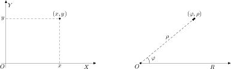

# Զրույց երկրորդ

Այս զրույցում ես պատմում եմ C լեզվի փոփոխականների, դրանց հայտարարման ու արժեքավորման մասին։ Ինչպես նաև այն մասին, թե ինչպես փոփոխականին վերագրել ստեղնաշարից ներմուծված արժեքը։

C լեզվով գրված ամեն մի ծրագիր, բացառությամբ պարզագույն դեպքերի, պարունակում է փոփոխականներ։ _Փոփոխականը_ մի օբյեկտ է, որը ծրագրի կատարման տարբեր պահերի կարող է պարունակել նախապես որոշված արժեքների տիրույթի (domain) մի որևէ արժեք։ Յուրաքանչյուր փոփոխական, որ հանդիպում է ծրագրում, պետք է նախապես _սահմանված_ լինի։ Փոփոխականի սահմանումը բաղկացած է նրա _տիպը_ որոշող ծառայողական բառից և փոփոխականի _անունից_։ Օրինակ,

```c
double a;      /* a-ն կրկնակի ճշտությամբ իրական թիվ է */
float b, c;    /* b-ն և c-ն սովորական ճշտության իրական թվեր են */
int d0, d1;    /* d0-ն և d1-ը ամբողջ թվեր են */
char sym;      /* sym-ը նիշ է (character) */
long int e1a;  /* e1a-ն երկար ամբողջ թիվ է */
```

Այստեղ `double`, `float`, `int`, `char` և `long` բառերը _ծառայողական բառեր_ են և _ներդրված_ տիպերի անուններ։ Իսկ `a`, `b`, `c`, `d0`, `d1`, `sym` և `e1a` բառերը իդենտիֆիկատորներ են։ C լեզվի _իդենտիֆիկատորը_ տառով կամ ընդգծման նիշով՝ «`_`», սկսվող տառերի ու թվանշանների հաջորդականություն է։ Պետք է հիշել, որ C լեզվում մեծատառերն ու փոքրատառերը տարբերվում են, այսինքն՝ `abc0` և `aBc0` բառերը տարբեր իդենտիֆիկատորներ են։

Փոփոխականի տիպով որոշվում է հիշողությունում նրա զբաղեցրած բայթերի քանակը և նրա հետ կատարվող թույլատրելի գործողությունները։ Օրինակ, իմ համակարգում `int` տիպ ունեցող փոփոխականը զբաղեցնում է 4 բայթ, `double` տիպ ունեցող փոփոխականը՝ 8 բայթ, իսկ `char` տիպի փոփոխականը՝ 1 բայթ։ Ծրագրի կատարման ժամանակ փոփոխականի զբողեցրած հիշողության չափը կարելի է ստանալ `sizeof` գործողության օգնությամբ։ Օրինակ, եթե `a0`-ն `double` տիպի փոփոխական է, ապա `sizeof(a0)` արտհայտության արժեքը 8 է։ `sizeof` գործողության արգումենտը կարող է լինել ոչ միայն փոփոխականի անուն, այլ նաև C լեզվի տիպի անուն։ Օրինակ, `sizeof(unsigned int)` արտահայտության արժեքը առանց նշանի ամբողջ թվերը որոշող տիպի չափն է։

Փոփոխականին կարելի է արժեք վերագրել հենց անմիջապես հայտարարության ժամանակ։ Ընդհանրապես, ծրագրավորման «լավ ոճ» է համարվում, երբ փոփոխականին արժեք է վերագրվում հայտարարության հետ միասին։ Օրինակ․

```c
int count = 0;       /* հայտարարել count ամբողջաթիվ փոփոխականը՝ 0 արժեքով */
double pi = 3.1415;  /* հայտարարել pi իրական փոփոխականը՝ 3.1415 արժեքով */
char c = 'A';        /* հայտարարել c նիշային փոփոխականը՝ «A» արժեքով */
```

Փոփոխականին նոր արժեք է տրվում `=` _վերագրման_ գործողությամբ։ Օրինակ,

```c
double a0, a1, b0;  /* a0-ն, a1-ը և b0-ն իրական թվեր են */
a0 = 2.36;          /* a0-ին վերագրել 2.36 */
a1 = 4.1;           /* a1-ին վերագրել 4.1 */
b0 = a0 + a1;       /* b0-ին վերագրել a0-ի և a1-ի գումարը */
```

Ծրագրի կատարման ժամանակ ամեն մի հայտարարված փոփոխականի հատկացվում է հիշողության մի որոշակի տիրույթ։ Այդ տիրույթի առաջին բայթի համարը փոփոխականի _հասցեն_ է, որը կարող ենք ստանալ `&` միտեղանի (unary) գործողությամբ։ Օրինակ, `&pi` արտհայտության արժեքը `pi` փոփոխականի հասցեն է։


Ես ուզում եմ ցույց տալ ու մեկնաբանել մի ծրագիր, որն օգտագործողից պահանջում է ներմուծել հարթության մի որևէ կետի դեկարտյան կոորդինատները և արտածում է նույն այդ կետի բևեռային կոորդինատները։

Պարզ է, որ կետի դեկարտյան կոորդինատները ներկայացնելու համար պետք է հայտարարել `x` և `y` իրական փոփոխականները, ապա դրանց արժեքները կարդալ ստեղնաշարից։

```c
double x = 0.0, y = 0.0;
scanf( "%lf", &x );  /* կարդալ իրական թիվ և վերագրել x-ին */
scanf( "%lf", &y );  /* նույնը՝ y-ի համար */
```

C լեզվի ստանդարտ գրադարանի `scanf` (scan formated ― ֆորմատավորված ընթերցում) ֆունկցիան ներմուծման ստանդարտ հոսքից (stdin) կարդում է նիշերի հաջորդականություն և այն ձևափոխում է ըստ տրված ֆորմատի։ `scanf` ֆունկցիայի առաջին արգումենտը ֆորմատավորման տողն է, որ կարող է պարունակել `%` նիշով սկսվող ֆորմատավորման հրահանգներ։ `%` նիշին հաջորդող նիշերով որոշվում է, թե ինչպես պետք է մեկնաբանվեն կարդացած տվյալները։ Օրինակ, եթե գրված է `%d`, ապա սա նշանակում է, որ հոսքից կարդացած նիշերը պետք է դիտարկել որպես տասական (decimal) թիվ։ Եթե գրված է `%f`, ապա՝ սովորական ճշտության իրական (float) թիվ։ Ֆորմատավորման հրահանգներին համապատասխան ձևափոխված տվյալները գրվում են `scanf` ֆունկցիայի երկրորդ և հաջորդ արգումենտներով տրված հասցեներում։ Օրինակ.

```c
scanf( "%lf", &x );
```

արտահայտության մեջ տրված `"%lf"` ֆորմատը նշում է, որ պետք է կարդալ երկար իրական թիվ (l - long, f - float) և կարդացած արժեքը գրել `x` փոփոխականի զբաղեցրած հասցեում։ `scanf` ֆունկցիային փոխանցվում է ոչ թե փոփոխականը, այլ նրա հասցեն՝ այն տեղը, որտեղ պետք է գրել կարդացած և ֆորմատավորած տվյալները։

`scanf` և `printf` ֆունկցիաների ֆորմատավորման հրահանգների մասին ես դեռ պատմելու շատ առիթներ կունենամ։ Առայժմ բավական է իմանալ, որ `"%lf"` ֆորմատը կարդում է `double` արժեք։

`x` և `y` փոփոխականների արժեքները կարդացող `scanf` ֆունկցիայի երկու կանչերը կարելի է միավորել մեկի մեջ՝ `"%lf"` ֆորմատը փոխարինելով `"%lf,%lf"` ֆորմատով։ Սա նշանակում է, որ `scanf` ֆունկցիան ստեղնաշարից կարդալու է իրարից ստորակետով բաժանված երկու `double` արժեք։

```c
double x = 0.0, y = 0.0;
scanf( "%lf,%lf", &x, &y );  /* կարդալ երկու իրական թվեր և վերագրել x-ին ու y-ին */
```

Դե քանի որ `scanf` ֆունկցիայի ֆորմատավորման տողը պարունակում է երկու ֆորմատավորման հրահանգ, ապա պետք է տալ կարդացած արժեքները գրելու երկու տեղ՝ `&x` և `&y`։

Եթե պետք լինի օգտագործողին ստիպել, որ նա կետի կոորդինատները ներմուծի `(` և `)` փակագծերի մեջ վերցրած, ապա կարելի է ֆորմատավորման տողը գրել `"(%lf,%lf)"` տեսքով։ Բառացիորեն սա կարելի է կարդալ հետևյալ կերպ. «_կարդալ `(` նիշը, կարդալ `double` թիվ, կարդալ `,` նիշը, կարդալ `double` թիվ, կարդալ `)` նիշը_»։

Կետի `x` _աբսցիսի_ և `y` _օրդինատի_ արժեքները կարդալուց հետո պետք է հաշվել նրա բևեռային կոորդինատները՝ `ρ` _շառավիղը_ և `φ` _ազիմուտը_։ Կոորդինատների բևեռային համակարգում `ρ`-ն որոշվում է որպես կետի հեռավորությունն բևեռից, իսկ `φ`-ն՝ որպես շառավղի և բևեռային առանցքի կազմած անկյուն։ Բևեռային շառավիղը որոշվում է Պյութագորասի թեորեմով՝ քանի որ այն իրենից ներկայացնում է ուղղանկյուն եռանկյան ներքնաձիգ։ Բևեռային անկյունը որոշելու համար էլ օգտվում ենք նույն ուղղանկյուն եռանկյունից և այն փաստից, որ որոնելի անկյան տանգենսը հավասար է նրա դիմացի էջի երկարության հարաբերությանը կից էջի երկարությանը՝ `y/x`, դե իսկ անկյան մեծությունն էլ հավասար կլինի այդ վերջին հարաբերության արկտանգենսին։



Ասվածը C լեզվով կարող եմ գրել հետևյալ արտահայտություններով․

```c
double rho = sqrt( x * x + y * y );
double phi = atan2( y, x );
```

`sqrt` ֆունկցիան վերադարձնում է արգումենտի երկրորդ աստիճանի արմատը, իսկ `atan2` ֆունկցիան վերադարձնում է `0` սկզբնակետ և `(x,y)` վերջնակետ ունեցող վեկտորի և աբսցիցների առանցքի կազմած անկյունը ռադիաններով։ Այս երկու ֆունկցիաներն էլ սահմանված են C լեզվի ստանդարտ գրադարանի `math.h` ֆայլում։

`rho` և `phi` արժեքների հաշվարկից հետո պարզապես պետք է արտածել դրանք․

```c
puts( "Բևեռային կոորդնատներն են․ " );
printf( "ρ = %lf, φ = %lf\n", rho, phi );
```

`printf` ֆունկցիայում նույնպես օգտագործվել են `"%lf"` ֆորմատավորման հրահանգները։ Քանի որ `printf` ֆունկցիան իր արգումենտները չի փոխում, այստեղ նրան փոխանցում ենք `x` և `y` փոփոխականների արժեքները, այլ ոչ թե հասցեները։

Վերջ։ Մնում է այս ամենը հավաքել `main` ֆունկցիայի մեջ, կոմպիլյացնել, գործարկել ու տեսնել արդյունքները։ Ես ամբողջ ծրագիրը գրել եմ `prog02.c` ֆայլի մեջ։

```c
#include <stdio.h>
#include <math.h>

int main()
{
  double x = 0.0, y = 0.0;
  puts( "Ներմուծիր դեկարտյան կոորդինատները x,y․ " );
  scanf( "%lf,%lf", &x, &y );

  double rho = sqrt( x * x + y * y );
  double phi = atan2( y, x );

  puts( "Բևեռային կոորդնատներն են․ " );
  printf( "ρ = %lf, φ = %lf\n", rho, phi );

  return 0;
}
```

`#include` դիրեկտիվով կցվել են `stdio.h` և `math.h` ֆայլերը։ Առաջինից օգտագործվում են `puts`, `scanf` և `printf` ֆունկցիաները, իսկ երկրորդից՝ `sqrt` և `atan2` ֆունկցիաները։

Երբ ես փորձում եմ `prog02.c` ֆայլը կոմպիլյացնել այնպես, ինչպես դա արեցի առաջին զրույցում նկարագրված `prog01.c` ֆայլի հետ.

```bash
$ clang prog02.c -o prog2
```

ապա ստանում եմ մի հաղորդագրություն, որն ասում է, թե linker ծրագիրը՝ _կապերի խմբագրիչը_, չի գտել `sqrt` և `atan2` ֆունկցիաները։

```
/tmp/prog02-80b543.o: In function `main':
prog02.c:(.text+0x6a): undefined reference to `sqrt'
prog02.c:(.text+0x91): undefined reference to `atan2'
clang: error: linker command failed with exit code 1 (use -v to see invocation)
```

Բանն այն է, որ `math.h` ֆայլը պարունակում է մաթեմատիկական գրադարանի հայտարարությունները, բայց ոչ սահմանումները։ Սահմանումները, այսինքն մաթեմատիկական գրադարանի կոմպիլյացված օբյեկտային կոդը, գտնվում է `libm.a` (ստատիկ) և `libm.so` (դինամիկ) օբյեկտային ֆայլերում։ ՈՒրեմն, երբ ծրագրի ֆայլում `#include` դիրեկտիվով կցում ենք `math.h` ֆայլը, դա անում ենք, պարզպես, որ կոմպլյատորն իմանա օգտագործվող ֆունկցիաների հայտարարությունները։ Իսկ կապերի խմբագրման (link) ժամանակ, երբ պետք է ստացվի կատարվող ֆայլ, կոմպիլյատորի `-l` պարամետրով պիտի տալ `m` գրադարանը (գրադարանների անունները սկսվում են lib նախածանցով, բայց `-l` պարամետրով գրադարանը նշելիս lib-ը չի գրվում)։

`prog02.c` ֆայլի կոմպիլյացիայի՝ վերը բերված հրամանն իրականում կատարվում է չորս քայլով՝ _նախամշակում_ (preprocessing), _կոմպիլյացիա_ (compilation), _ասեմբլացում_ (assembly) և _կապակցում_ (linking)։ Նախամշակման փուլում մշակվում են `#` նիշով սկսվող հրահանգները. `#include` հրահանգով կցվում են ֆայլեր, `#define` հրահանգով սահմանվում են մակրոսներ և այլն (նախամշակման քայլի մասին մանրամասն կխոսեմ քիչ ավելի ուշ)։ Կոմպիլյացիայի փուլում C լեզվով գրված ծրագիրը թարգմանվում է ասեմբլերի լեզվով գրված ծրագրի։ Ասեմբլացման փուլում ասեմբլերի լեզվով ծրագիրը թարգմանվում է կոնկրետ ապարատային պլատորմի վրա աշխատող կոնկրետ օպերացիոն համակարգի օբյեկտային կոդի։ Կապակցման փուլում իրար են կցվում առանձին-առանձին կոմպիլյացված օբյեկտային մոդուլները, ստեղծվում է կատարվող մոդուլ։ Եթե ուզում ես տեսնել, թե այդ միջանկյալ քայլերում ինչ ֆայլեր են գեներացվում, ապա կարող ես կոմպիլյացիայի հրամանին տալ `--save-temps` պարամետրը.

```bash
$ clang --save-temps -o prog02 prog02.c -lm
```

Այս հրամանի կատարումից հետո ստեղծվում են `prog02.i`, `prog02.s`, `prog02.o`, `prog02` ֆայլերը։ Դրանք համապատասխանաբար նախամշակման, կոմպիլյացիայի և ասեմբլացման փուլերում ստեղծված ֆայլերն են։ Կապակցման արդյունքում ստացված ֆայլը ստանում է կոմպիլյատորի ՝-օ՝ պարամետրով տրված անունը։

Կոմպիլյացիայի քայլերը ես էլ կարող եմ առանձնացնել։

1. `clang -E -o prog02.i prog02.c` ― Նախամշակել, բայց չկոմպիլյացնել։ Ստեղծվում է `prog02.i` ֆայլը։
2. `clang -S -o prog02.s prog02.i` ― Կոմպիլյացնել նախամշակված ֆայլը, բայց չասեմբլացնել։ Ստեղծվում է `prog02.s` ֆայլը։
3. `clang-3.5 -c -o prog02.o prog02.s` ― Ասեմբլերային ֆայլը թարգմանել օբյեկտային ֆայլի։ Ստեղծվում է `prog02.o` ֆայլը։
4. `clang -o prog02 prog02.o -lm` ― Օբյեկտային ֆայլը կապակցել գրադարանների հետ և ստեղծել `prog02` կատարվող մոդուլը։


Հիմա արդեն ամեն ինչ կարգին է․ ֆայլը թարգմանվել է և կառուցվել է `prog02` կատարվող ֆայլը։ Գործարկեմ այն ու տեսնեմ, թե ինչ է ստացվում․

```bash
$ ./prog02
Ներածիր դեկարտյան կոորդինատները x,y․
3,2
Բևեռային կոորդնատներն են․
ρ = 3.605551, φ = 0.588003
```

Հենց որ ծրագիրն առաջարկում է ներածել `x` և `y` դեկարտյան կոորդինատները, ես ներածում եմ `3,2` թվերը։ Դրան ի պատասխան ծրագիրն արտածել է `ρ = 3.605551` և `φ = 0.588003` արժեքները։


Այս զրույցի համար էլ այսքանը։ Հաջորդ զրույցում կպատմեմ ֆունկցիաների սահմանման, դրանց արգումենտների ու վերադարձրած արժեքի մասին։


