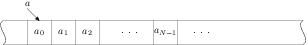

# Զրույց վեցերորդ

Ստրուկտուրաները հնարավորություն են տալիս սահմանելու տարբեր տիպերի դաշտեր ունեցող բաղադրյալ օբյեկտներ։ Հաճախ նաև պետք է լինում սահմանել տարրերի նույն տիպն ունեցող բաղադրյալ օբյեկտներ՝ զանգվածներ։ Այս զրույցը C լեզվի զանգվածների և հաշվիչով ցիկլի մասին է։

_Զանգվածը_ նույն անունն ունեցող միատեսակ տարրերի անընդհատ շարք է։ Դրա մի որևէ տարրին կարելի է դիմել _ինդեքսավորման_ գործողությամբ, զրոյից սկսվող ինդեքսի միջոցով։ Օրինակ, եթե `a`-ն `N` տարրեր ունեցող զանգված է, ապա նրա առաջին տարրին կարելի է դիմել `a[0]` գրառմամբ, իսկ վերջին տարրին՝ `a[N-1]` գրառմամբ։ C լեզվում որևէ տիպի օբյեկտների զանգվածը հայտարավում է փոփոխականի անունից հետո `[` և `]` փակագծերում տարրերի քանակը նշելով։



Օրինակ, առանց նշանի ամբողջ թվերի տաս տարրերից բաղկացած զանգված կարող ենք սահմանել հետևյալ հրամանով.

```c
unsigned int v0[10];
```

Զանգվածը հայտարարելիս կարելի է միանգամից արժեքավորել նրա տարրերը։ Օրինակ.

```c
int v1[5] = { 1, 2, 3, 4, 5 };
```

Այս հրամանով սահմանված է հինգ ամբողջ թվերի զանգված, և տարրերն արժեքավորված են `1..5` միջակայքի թվերով։

Համանման ձևով են սահմանվում նաև բազմաչափ զանգվածները։ Օրինակ, `2⨯3` չափի մատրիցը կարելի է սահմանել ու արժեքավորել այսպես.

```c
double m0[2][3] = { {1.1, 1.2, 1.3}, {2.2, 2.3, 2.4} };
```

Եթե զանգվածը սահմանելիս արժեքավորման ցուցակում տրված են ավելի քիչ արժեքներ, քան զանգվածի չափն է, ապա պակասող արժեքների փոխարեն զանգվածում գրվում են զրոներ։ Օրինակ, հետևյալ սահմանումից հետո եթե վերցնեմ `v2` զանգվածի հինգերորդ տարրը, ապա կտեսնեմ, որ այն զրո է։

```c
long double v2[10] = { 1.2, 2.3 };
```

Պակասող տարրերը զրոներով արժեքավորելու հատկությունը օգտակար է զանգվածներին սկզբնական արժեքներ տալիս։ Անորոշություններից խուսափելու համար միշտ խորհուրդ է տրվում նոր սահմանվող զանգվածը արժեքավորել `{ 0 }` արտահայտությամբ։ Ահա այսպես.

```c
unsigned int v3[128] = { 0 };
```


C լեզվում զանգվածի անունը _ցուցիչ_ է իր առաջին տարրին, իսկ զանգվածի տարրերին կարելի է դիմել ոչ միայն `[]` գործողությամբ, այլ նաև ցուցիչների հետ թվաբանական գործողություններ կատարելով։ Օրինակ, `v1` զանգվածի երրորդ տարրն արտածելու համար կարող ենք գրել հետևյալ երկու համարժեք հրամանները.

```c
printf( "%d\n", v1[2] );
printf( "%d\n", *(v1 + 2) );
```


Զանգվածների հետ աշխատանքը ցուցադրելու համար ուզում եմ բերել մի օրինակ՝ նորից օգտագործելով դեկարտյան կետը։ Ենթադրենք դեկարտյան կետերի `ps` զանգվածը պարունակում է հարթության վրա ցրված `N` հատ կետեր։ Պետք է գրել մի ֆունկցիա, որը վերադարձնում է տրված կետերը որպես գագաթներ ունեցող բեկյալի երկարությունը։

Հիշեցնեմ `point` ստրուկտուրայի հայտարարությունը.

```c
struct point {
  double x;
  double y;
};
```

Բեկյալի երկարությունը նրա հանգույցների երկարությունների գումարն է։ Ամեն մի հանգույցի երկարությունը նրա ծայրակետերի հեռավորությունն է, որը հաշվում եմ Պյութագորասի բանաձևով։

```c
double distance( struct point a, struct point b )
{
  double dx = a.x - b.x;
  double dy = a.y - b.y;
  return sqrt( dx * dx + dy * dy );
}
```

Բեկյալի երկարությունը հաշվող `length` ֆունկցիան կարող է ունենալ հետևյալ հայտարարությունը.

```c
double length( const struct point[], int );
```

Սա նշանակում է, որ `length` անունով ֆունկցիան արգումենտում սպասում է `struct point` օբյեկտների զանգված և մի ամբողջ թիվ, որը զանգվածի տարրերի քանակն է։ Ֆունկցիայի վերադարձրած `double` արժեքն էլ բեկյալի երկարությունն է։ `const` ծառայողական բառը ցույց է տալիս, որ զանգվածը ֆունկցիային է փոխանցվել որպես _հաստատուն_. նրա արժեքները կարելի է միայն կարդալ (read-only), բայց չի կարելի փոփոխել։

Ի դեպ, քանի որ զանգվածի անունն իր առաջին տարրի ցուցիչն է, վերը բերված հայտարարությունը կարող է ունենալ նաև հետևյալ համարժեք տեսքը.

```c
double length( const struct point*, int );
```

`N` գագաթներ (`N-1` հանգույցներ) ունեցող բեկյալի երկարությունը ես կհաշվեմ ռեկուրսիվ եղանակով՝ ըստ գագաթների քանակի։ Եթե զանգվածում մեկ տարր է, ապա բեկյալը հանգույցներ չունի և նրա երկարությունը զրո է։ Եթե բեկյալն ունի `n` գագաթներ, ապա նրա երկարությունը հավասար է `n-1`-րդ և `n`-րդ գագաթների հեռավորությանը գումարած առաջին `n-1` գագաթներից կազմված բեկյալի երկարությունը։

```c
double length( const struct point ps[], int nm )
{
  if( nm == 1 )
    return 0.0;
  return distance( ps[nm-1], ps[nm-2] )
       + length( ps, nm-1 );
}
```

Կարծես թե ճիշտ է, բայց ստուգելը չի խանգարի։ Սահմանեմ մի վեկտոր, որը պարունակում է `f(x)=x` ուղղին պատկանող `(0,0)`, `(1,1)`, `(2,2)` և `(3,3)` կետերը, ապա հաշվեմ ու արտածեմ այդ կետերով կազմված բեկյալի (ուղիղ գծի) երկարությունը։

```c
int main()
{
  struct point ps[] = { {0,0}, {1,1}, {2,2}, {3,3} };
  double res = length( ps, 4 );
  printf( ">> %lf\n", res );
  return 0;
}
```

`points` զանգվածը սահմանելիս ես նրա չափը բացահայտ չեմ նշել։ Եթե առկա է զանգվածն արժեքավորող ցուցակ, ապա կոմպիլյատորը զանգվածի չափը պարզում է այդ ցուցակում տրված արժեքների քանակով։ Տվյալ դեպքում թվարկված են չորս կետի կոորդինատներ, հետևաբար `points` զանգվածի չափը `4` է։


Զանգվածի տարրերին հաջորդաբար դիմելու ամենահարմար միջոցը C լեզվի `for` կրկնման հրամանն է։ Այս `for` հրամանը հիմնականում օգտագործվում է _հաշվիչով կրկնություններ_ կազմակերպելու համար։

```
for( ⟨հաշվիչի արժեքավորում⟩ ; ⟨կրկնման պայման⟩ ; ⟨հաշվիչի փոփոխում⟩ )
  ⟨կատարվող մարմին⟩
```

Նախ՝ հաշվարկվում է `⟨հաշվիչի արժեքավորում⟩` արտահայտությունը, որով սահմանվում և սկզբնական արժեք է ստանում ցիկլի հաշվիչը։ Այնուհետև, քանի դեռ _կեղծ է_ `⟨կրկնման պայման⟩` արտահայտության արժեքը, կատարվում են ցիկլի `⟨կատարվող մարմին⟩` բլոկի հրամանները։ Ցիկլի մարմնի հրամանների կատարումից հետո հաշվարկվում է `⟨հաշվիչի փոփոխում⟩` արտահայտությունը, որը նախատեսված է ցիկլի հաշվիչը ինչ-որ կանոնով փոփոխելու (ավելացնելու կամ պակասեցնելու) համար։

Օրինակ, եթե պետք լինի գտնել իրական թվերի զանգվածի ամենամեծ տարրը, ապա կարող եմ գրել հետևյալ ֆունկցիան.

```c
double amax( const double arr[], int num )
{
  double max = arr[0];
  for( int k = 1; k < num; ++k )
    if( max < arr[k] )
      max = arr[k];
  return max;
}
```

`amax` ֆունկցիայի `for` հրամանում `int k = 1` արտահայտությամբ սահմանվել է `k` հաշվիչը և նրան տրվել է `1` սկզբնական արժեքը։ Այդ `for` հրամանում որպես ցիկլի ավարտի պայման է նշված `k < num` արտահայտությունը։ Սա նշանակում է, որ ցիկլը կկատարվի այնքան անգամ, քանի դեռ `k`-ն փոքր է `num`-ից։ Նույն `for` հրամանում `k` հաշվիչը փոփոխվում է `++k` արտահայտությամբ, որը ցիկլի ամեն մի իտերացիայից հետո `k`-ի արժեքն ավելացնում է մեկով։

Արժեքի _ավելացման_ `++` (increment) գործողությունը C լեզվում հանդես է գալիս _նախածանցային_ (prefix) և _վերջածանցային_ (postfix) տեսքերով։ Օրինակ, կարելի է գրել և՛ `++k`, և՛ `k++`։ Առաջին դեպքում արտահայտության արժեքը `k`-ի նոր արժեքն է, իսկ երկրորդ դեպքում՝ հինը։ Օրինակ, կարող եմ սահմանել `inc_pr` և `inc_po` ֆունկցիաները, որոնցից առաջինը համարժեք է `++` գործողության նախածանցային տարբերակին, իսկ երկրորդը՝ վերջածանցային տարբերակին։

```c
/* նախածանցային ինկրեմենտի մոդելը */
int inc_pr( int* var )
{
  *var = *var + 1;
  return var;
}

/* վերջածանցային ինկրեմենտի մոդելը */
int inc_po( int* var )
{
  int old = *var;
  *var = *var + 1;
  return old;
}
```

`++` գործողության նմանությամբ C լեզուն տրամադրում է նաև արժեքի _նվազեցման_ `--` (decrement) գործողությունը։ Սա նույնպես հանդես է գալիս նախածանցային ու վերջածանցային տարբերակներով։


Բեկյալի երկարությունը հաշվող `length` ֆունկցիան, որ սահմանեցի վերևում, նույնպես կարող եմ գրել `for` ցիկլի օգնությամբ։ [Բայց պիտի ասեմ, որ ռեկուրսիվ իրականացումն ինձ ավելի _գեղեցիկ_ է թվում։]

```c
double length( struct point ps[], int nm )
{
  double result = 0.0;
  for( int j = 1; j < nm; ++j )
    result += distance( ps[j-1], ps[j] ) ;
  return result;
}
```

Այս ֆունկցիայի `for` հրամանի մարմնում օգտագործված `+=` գործողությունն իր աջ կողմում գրված արտահայտության արժեքը ավելացնում է ձախ կողմում գրված փոփոխականին։ Ավելի պարզ ասած՝ `⟨var⟩ += ⟨val⟩` արտահայտությունը համարժեք է `⟨var⟩ = ⟨var⟩ + ⟨val⟩` արտահայտությանը։ Նույն տիպի «կրճատ» վերագրման տարբերակներ կան նաև հանման՝ `-=`, բազմապատկման՝ `*=`, բաժանման՝ `/=` և այլ գործողությունների համար։

Եվս մի օրինակ, ու վերջացնեմ զանգվածների մասին զրույցը։ Գրեմ մի ֆունկցիա, որը տրված իրական թվերի միաչափ զանգվածի տարրերը դասավորում է հակառակ կարգով։

```c
void areverse( double arr[], int nm )
{
  for( int b = 0, e = nm - 1; b < e; ++b, --e ) {
    double temp = arr[b];
    arr[b] = arr[e];
    arr[e] = temp;
  }
}
```

`for` հրամանում սահմանվել են երկու հաշվիչներ՝ `b`, որը «շարժվում» է զանգվածի սկզբից դեպի վերջը, և `e`, որը «շարժվում» է վերջից դեպի սկիզբը։ Ցիկլը կատարվում է այնքան անգամ, քանի դեռ զանգվածի `b` ինդեքսը փոքր է `e` ինդեքսից։ Ցիկլի ամեն մի իտերացիայից հետո `b` ինդեքսն աճում է, իսկ `e`-ն՝ նվազում։ `++b, --c` արտահայտության մեջ նույնպես օգտագործված է `,` (ստորակետ) _թվարկման_ գործողությունը։ Դե իսկ ցիկլի մարմնում, որն այս դեպքում բաղկացած է երեք հրամաններից, կատարվում է արժեքների տեղափոխությունը՝ `b`-րդ տարրը գրվում `e`-րդի փոխարեն և հակառակը։ Հենց այն պատճառով, որ `for` հրամանի մարմնում մի քանի հրամաններ են, մարմինը վերցրած է `{` նիշով սկսվող և `}` նիշով ավարտվող _բլոկի_ մեջ։ Պետք է նշել, որ բլոկում սահմանված փոփոխականը _լոկալ_ է՝ տեսանելի է միայն բլոկի մարմնում։

Ես ուզում էի այս օրինակով ավարտել զանգվածների ու պարամետրով ցիկլի մասին զրույցը, բայց խոսքը խոսք բերեց ու ես որոշեցի գրել `areverse` ֆունկցիայի մի այլ տարբերակ։ `areversep` ֆունկցիայում, զանգվածի տարրերին դիմելիս, ինդեքսների փոխարեն օգտագործում եմ ցուցիչներ։

```c
void areversep( double* arr, int nm )
{
  for( double *p = arr, *q = arr + nm - 1; p < q; ++p, --q ) {
    double temp = *p;
    *p = *q;
    *q = temp;
  }
}
```

Արդեն ասել եմ, որ C լեզվի կոմպիլյատորը զանգվածի անունը համարում է ցուցիչ նրա առաջին տարրին։ Դա հաշվի առնելով `areversep` ֆունկցիայի `arr` պարամետրը նկարագրել եմ որպես `double*`։ Այնուհետև՝ `for` հրամանի հաշվիչները սահմանում եմ ոչ թե որպես զանգվածի ինդեքսներ, այլ որպես նրա տարրերի ցուցիչներ. `p`-ն ստանում է նույն `arr` սկզբնական արժեքը, իսկ `q`-ն՝ `arr + nm - 1` արժեքը, որը զանգվածի վերջին տարրի հասցեն է։ Ցիկլը կատարվում է, քանի դեռ `p` հասցեն փոքր է `q` հասցեից։ C լեզվում երկու ցուցիչների համեմատությունն իմաստալից է միայն այն դեպքում, եթե դրանք ցույց են տալիս միևնույն զանգվածի տարրերին։ `++` և `--` գործողությունները նույնպես թույլատրելի են ցուցիչների նկատմամբ։ `++`-ը ցուցիչը տեղափոխում է իրեն հաջորդող տարրին, իսկ `--`-ը՝ իրեն նախորդող տարրին։


